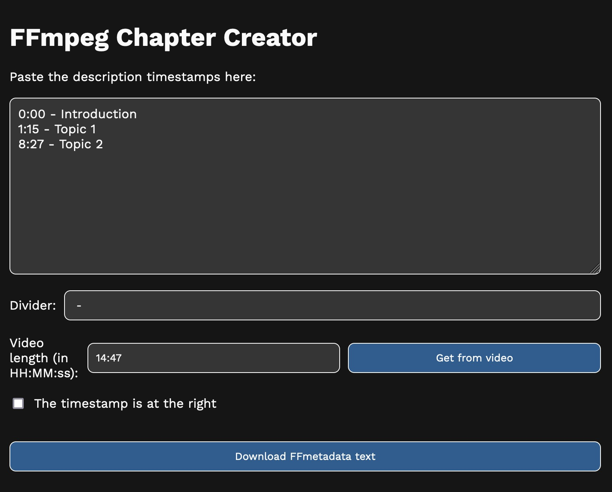

# ffmpeg-chapters-fetcher

Convert a normal timestamp list in a ffmetadata file that can be used to add
timestamps using ffmpeg.

## What this website does

Let's say you've got a timestamp list:

```
0:00 - Introduction
1:15 - Topic 1
8:27 - Topic 2
```

It can be useful to embed it directly to the video, so that lots of players
(like VLC) will show them on the progress bar. This can be done with FFmpeg, but
you need to generate a file that tells FFmpeg the chapters to add. This small
website is able to create this file.



As you can see from the screenshot, you need firstly to copy the timestamps in
the main textarea. If you don't have them, but the same video is on YouTube, you
can use a small script to paste in the console to get them.
[You can read more about this below.](#fetching-chapters-from-youtube)

Later, you need to tell the script what the divider is. Make sure it's correct
(even the spacing must be right), otherwise the output file will be wrong. If
timestamps are located on the right, make sure to tick the last checkbox.

Finally, it might be useful to provide the video length, so that we can mark the
last second as the one where the video ends. You can manually put it, or, if
you've the video downloaded, you can just pick it and the script will get it
automatically. Note that, for this feature, file support is limited by the codec
support of your browser (your video will never be uploaded anywhere – everything
happens locally on your device).

Finally, click the `Download FFmetadata text` to download the file we'll need

## How can I actually add the chapters to the file

Now, you'll need to use ffmpeg. Make sure you've installed it on your device.
This is the command you need to run:

```
ffmpeg -i video.mp4 -f ffmetadata -i ffmetadata.txt -c copy output.mp4
```

Where:

- `video.mp4` is the input video file, replace it with the real path of the
  video file
- `ffmetadata.txt` is the downloaded file from this website, replace it with the
  real path of it
- `output.mp4` is the output file

### Keeping original metadata

This will replace the metadata of the original video to add the chapters. If you
want to keep the original metadata, follow these instructions:

First, export the FFmetadata of the original file. Write the following command:

```
ffmpeg -i video.mp4 -f ffmetadata metadata.txt
```

Replace `video.mp4` with the real video file path and `metadata.txt` with
whatever you like, the important thing is that you've access to it.

Now, open `metadata.txt` and copy everything but the first line. Paste it on the
downloaded file from this website after the first line. Now, execute the command
to merge the chapters, and metadata will be kept.

## Fetching chapters from YouTube

If you've found some chapters on YouTube, you can export it using the small
[YouTube Extractor script](./YouTube%20Extractor.js). Open the video, and make
sure you haven't opened the timestamp list at the right of the video. Now, open
the developer console (Ctrl/Cmd + Shift + I) and paste the content in the
[YouTube Extractor script](./YouTube%20Extractor.js). A file with the chapters
will be downloaded. Now, paste the content of the file in the main textarea of
this website, and continue.

## Privacy

Everything is elaborated locally on your device, and nothing is sent to a
server. You can download the HTML webpage and use it offline.
